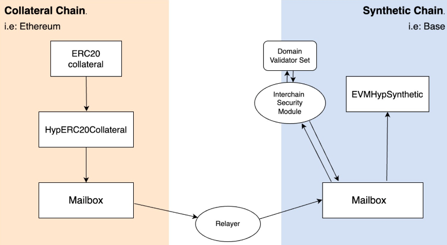

# Developer Workshop: Hyperlane Warp Routes 🌉

This guide explains how to create and deploy a **Warp Route** for the **FAI token** on **Base** with a synthetic token on **Optimism Mainnet**, using Hyperlane Warp Routes.

---

## Primer

Warp Routes let you move tokens between chains using Hyperlane. They’re modular bridges that you can configure and deploy yourself. Each Warp Route is made up of smart contracts on the chains you want to connect. These contracts talk to each other through Hyperlane’s general message passing system.

You can create different types of Warp Routes depending on what you need. For example:

- You can lock tokens on one chain and mint synthetic tokens on another
- You can allow users to burn tokens on one chain and unlock them on another
- You can create routes that pull collateral from multiple chains

The way tokens are handled (locked, minted, burned, or released) depends on the type of Warp Route you set up.

Under the hood, Warp Routes rely on a few key components:

- A Mailbox contract on each chain to send and receive cross-chain messages. These are the entry/exit points to the chains.
- A Warp Route contract deployed on each chain
- An ISM (Interchain Security Module) that defines how messages are verified between chains. ISMs let you configure the security requirements for your chain.

### Example Architecture
Here's a simplified architecture diagram of a Collateral to Synthetic Warp Route using the lock-and-mint model to transfer ERC-20 tokens between two chains: 


> 👉 **More on Warp Routes:** [https://docs.hyperlane.xyz/docs/protocol/warp-routes/warp-routes-overview](https://docs.hyperlane.xyz/docs/protocol/warp-routes/warp-routes-overview)


## 🛠️ What are we building today?

In this workshop, you’ll build a Warp Route for the FAI token, where:

- Base is the origin chain that holds the original FAI token (Collateral token)
- Optimism Mainnet is the destination chain, where a synthetic version of FAI will be created (Synthetic token)

This is a Collateral → Synthetic Warp Route. The original FAI tokens on Base will be locked, and a synthetic (wrapped) FAI token will be minted on Optimism.

---

## Step-by-Step: Create and Deploy a Warp Route

*This guide follows the [How to Bridge a Token with Hyperlane Warp Routes](https://docs.hyperlane.xyz/docs/guides/deploy-warp-route) quickstart guide.*

### **1. Install the Hyperlane CLI**

To start, install the Hyperlane CLI using npm:

```bash
# Install with NPM
npm install -g @hyperlane-xyz/cli
# Or uninstall old versions
npm uninstall -g @hyperlane-xyz/cli
```

Verify your installation by checking the version:

```bash
hyperlane --version
```

To learn more about the CLI, head over to: [Hyperlane CLI](https://docs.hyperlane.xyz/docs/reference/cli)

### **2. Set Your Private Key (HYP_KEY)**

Export your private key as an environment variable. The CLI uses HYP_KEY to deploy contracts and interact with chains:

```bash
export HYP_KEY=your_private_key_here
```

### **3. Initialize the Warp Route**

_**Note:** To check which chains are already supported, visit the [Hyperlane Registry](https://github.com/hyperlane-xyz/hyperlane-registry/tree/main/chains). If your chain is not listed, you’ll need to deploy Hyperlane to your chain first. Refer to the [Deploy to a new Chain](https://docs.hyperlane.xyz/docs/deploy-hyperlane) guide for steps to deploy the core contracts & register your chain._

Run the following command to set up the warp route:

```bash
hyperlane warp init
```

During initialization:

1. Select Chains to Connect:

   - Source Chain (Token Origin): Base
     - proxyAdmin: "0x4Ed7d626f1E96cD1C0401607Bf70D95243E3dEd1"
     - proxy admin from the hyperlane registry: https://github.com/hyperlane-xyz/hyperlane-registry/blob/main/chains/base/addresses.yaml
   - Destination Chain: Optimism Mainnet
     - proxyAdmin: "0xE047cb95FB3b7117989e911c6afb34771183fC35"
     - proxy admin from the hyperlane registry: https://github.com/hyperlane-xyz/hyperlane-registry/blob/main/chains/optimism/addresses.yaml

2. Choose Warp Route Type:

   - Collateral on Base (FAI token)
   - Synthetic on Optimism Mainnet (HypERC20 token)

3. Enter Token Details:
   - Source Token Address (FAI on Base): 0xb33Ff54b9F7242EF1593d2C9Bcd8f9df46c77935
   - Destination Token: The synthetic HypERC20 token, which will be created on Optimism Mainnet.

```bash
✅ Successfully created new warp route deployment config.
```

##### Understanding Synthetic Tokens

Synthetic tokens are created on the destination chain to represent the original token. In this case:

- Original Token: FAI on Base (0xb33Ff54b9F7242EF1593d2C9Bcd8f9df46c77935)
- Synthetic Token: HypERC20 on Optimism Mainnet, deployed as part of the warp route.

Synthetic tokens are implemented in the HypERC20.sol contract and inherit standard ERC20 functionality.

### **4. Deploy the Warp Route Contracts**

Deploy the warp route with the following command:

```bash
hyperlane warp deploy
```

During deployment gas usage and statistics will be displayed. Deployment outputs will include the final configuration.

### **5. Interact with the Hyperlane UI & Verify the Warp Route**

Once the contracts are deployed, you can manage and test the warp route through the Hyperlane UI and the [SuperBridge Playground](https://hyperlane.superbridge.app/).
